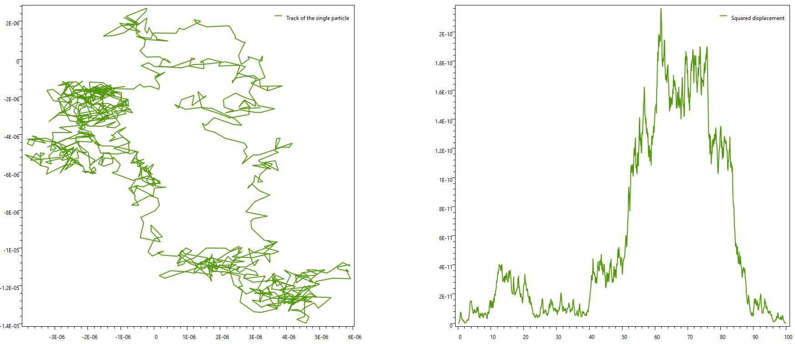
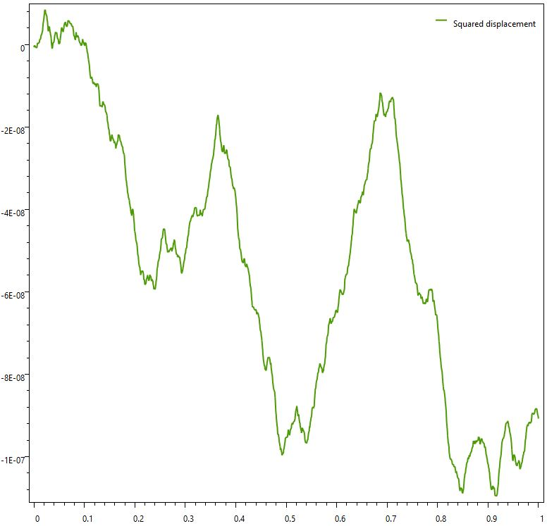

# Brownian Motion

Brownian Motion (pedesis) describes the random movement of small particles suspended in a liquid or a gas due to their collisions with other molecules or atoms. 

## Fractional Brownian Motion
Fractional Brownian Motion is a generalization of Brownian Motion. It's a Gaussian random function that is described by the following covariance function:

Where _H ϵ (0,1)_ is the Hurst parameter.
For _H = 1/2_ the Fractional Brownian Motion is a Brownian Motion.

## :link: Useful links
* [Brownian Motion](http://galileo.phys.virginia.edu/classes/304/brownian.pdf)
* [Fractional Brownian Motion](https://users.math.yale.edu/~bbm3/web_pdfs/052fractionalBrownianMotions.pdf)
